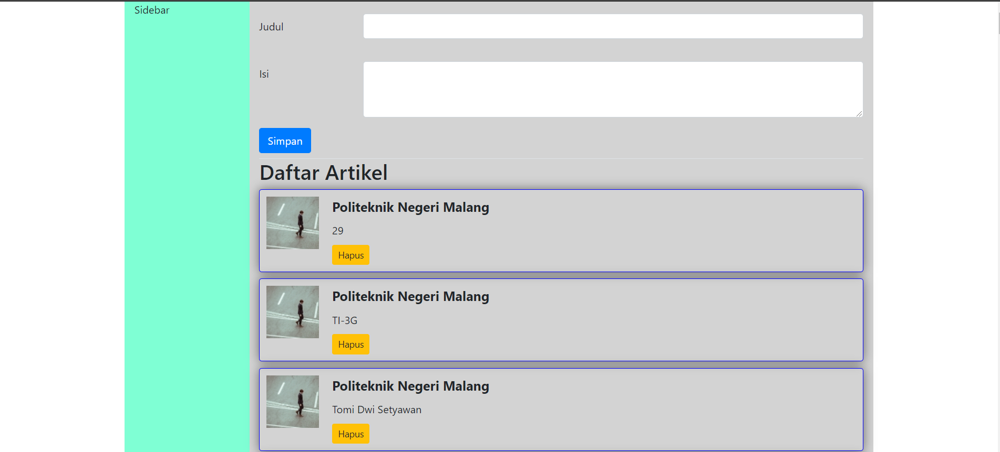
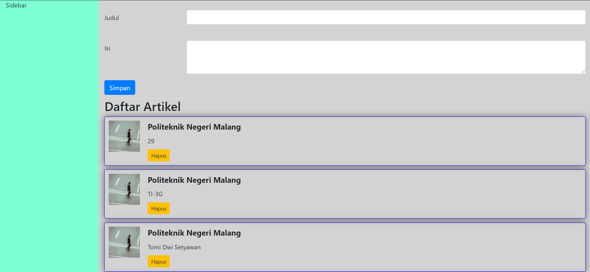

# Jawaban Pertanyaan Pertemuan 5

## Pertanyaan Praktikum 1

a.  Ganti class container dengan container-fluid

1. Tampilan
    
    Container
    

    Container-fluid
    

2. Perbedaannya jika container hasilnya tidak full terdapat margin left dan margin right sedangkan container-fluid hasilnya full.

b. Melakukan Import Jika tidak ditemukan, install lewat cmd dengan perintah “npm install bootstrap”

## Pertanyaan Praktikum 2

a. Karena disini port dari 3000 masih dijalankan maka otomatis port 3000 tidak bisa digunakan

b. Tidak bisa berjalan karena port 3000 sudah dipakai

## Pertanyaan Praktikum 3

a. Daftar artikel terhapus sesuai dari data yang dihapus jika saya melakukan klik pada tombol hapus 

b. Data dari file listArtikel.json akan berkurang karena sudah melakukan klik tombol delete

c. Untuk mengambil data sesuai idnya lalu dilakukan method delete

d.  API yang diambil memiliki sumber data yang berbeda, yang satunya di jsonplaceholder, sedangkan satunya berada di local dengan sumber data listArtikel.json

## Pertanyaan Praktikum 4

a. Data pada file listArtikel.json akan bertambah jika melakukan penambahan data

b. Karena pada dasarnya data terbaru disimpan paling bawah 